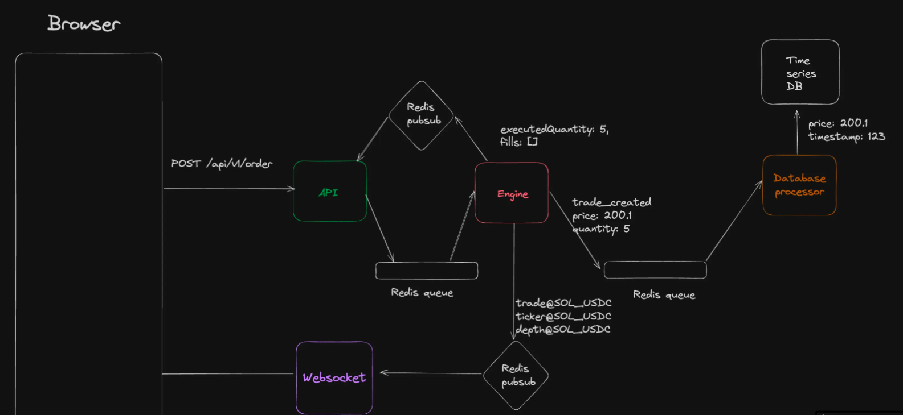

# 🚀 Cryptocurrency Exchange System

## Overview
This project implements a **high-performance cryptocurrency exchange system** focusing on **scalability**, **concurrency**, and **real-time data updates**. The architecture leverages modern technologies like **Redis**, **TimescaleDB**, and **WebSockets** to deliver efficient trading capabilities.

--- 

We welcome contributions from all developers and would love to connect with like-minded individuals who are passionate about cryptocurrency, high-performance systems, and real-time data.

---

## 🏗️ System Architecture


## 🖼️ System Architecture Diagram

_The diagram illustrating the high-level architecture of the system._


The system is divided into the following services:

- **API**: Handles HTTP requests from users.
- **Engine**: Maintains market orderbooks and user balances (stored in memory for high-speed access).
- **WebSocket**: Streams real-time events to clients.
- **DB Processor**: Processes messages from the Engine and persists them into the database.
- **Frontend**: A Next.js application that provides the user interface.
- **Market Maker (MM)**: Generates random orders to maintain market liquidity.
- **Redis**: Used for queueing and Pub/Sub operations.
- **TimescaleDB**: Manages time-series data and creates Kline data buckets for analytics.

### Primary Database
- **PostgreSQL** is suggested as the primary database to store critical data such as user information, orders, trades, etc.

---

## 📡 WebSocket Streaming
The system supports the following WebSocket streams:

- **Trades**: `trades@MARKET`
- **Orderbook Depth**: `depth@MARKET`
- **Ticker Updates**: `ticker@MARKET`

---

## ⚙️ Working Flow

### Sequential Processing
The workflow ensures that all operations are sequential rather than concurrent, guaranteeing data consistency and preventing race conditions.

### Single Engine
A single engine is responsible for maintaining the **orderbook** and **user balances**, ensuring **data integrity** throughout the system.

### Database Operations
- **Time series data** stores trade and order events, which are later transformed into **Kline (Candlestick)** data for analytics.
- A **locking mechanism** ensures secure operations, such as **fund creation** and **updates**, preventing inconsistent states in concurrent environments.

### Critical Functionality

#### `createAndLockFunds()`
This function ensures that funds are locked securely during critical operations. It uses precise **technical and mathematical reasoning** to prevent **race conditions** and **inconsistent states**.

---

## 🛠️ Local Setup

Follow the instructions below to set up the project locally.

### Set up TimescaleDB and Redis:
1. Navigate to the `docker` directory:
    ```bash
    cd docker
    ```

2. Start the services:
    ```bash
    docker-compose up
    ```

3. If PostgreSQL is running, disable and stop it:
    ```bash
    sudo systemctl disable postgresql
    sudo systemctl stop postgresql
    ```

---

### Start Services:
1. **API Server:**
    ```bash
    cd api
    npm install
    npm run dev
    ```

2. **Engine:**
    ```bash
    cd engine
    npm install
    npm run dev
    ```

3. **WebSocket Server:**
    ```bash
    cd ws
    npm install
    npm run dev
    ```

4. **Frontend:**
    ```bash
    cd frontend
    npm install
    npm run dev
    ```
5. **market makers:**
    ```bash
    cd mm
    npm install
    npm run dev
    ```

---

## 📝 Important Considerations

- **Orderbook and User Balances**: These are stored in memory for fast access and processing.
- **Locking Balances**: Ensures secure fund management during operations like placing orders or withdrawals.

---

## 🤔 Counterintuitive Points

- **In-Memory Operations**: Critical data (like balances and orderbooks) is stored in memory for high performance. The DB Processor ensures eventual consistency by persisting this data into TimescaleDB and PostgreSQL.
  
- **Sequential Workflow**: Despite the system's concurrency at the service level, individual operations follow a sequential workflow to ensure reliability and avoid data inconsistency.

---
## 🤝 Contributing

We encourage you to contribute to this project! If you find any issues, have suggestions for improvement, or want to add new features, feel free to open a pull request. Your contributions are always welcome.

We'd love to connect with developers who are passionate about building scalable, real-time systems. Let's grow this project together!

---

## 🔧 Troubleshooting

- If you encounter issues with database connections or WebSocket streaming, ensure that all services are running and Docker is correctly configured.
- For issues with the API server or engine, check the logs for detailed error messages.

---

